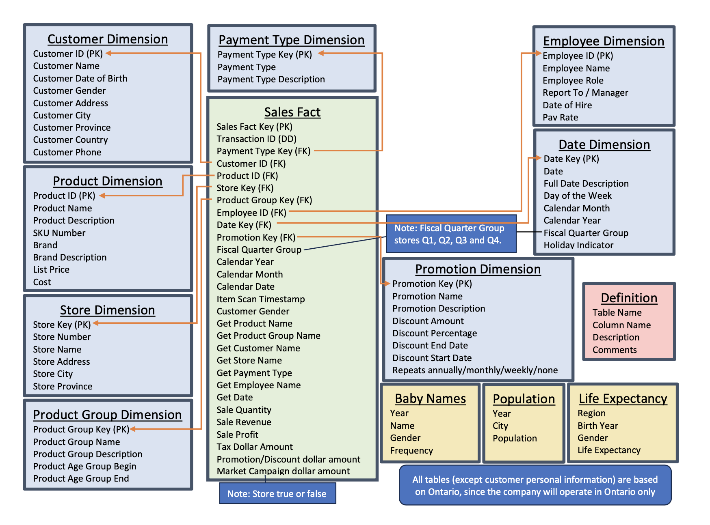

# Personalized Products Sales Data Warehouse
## Project Overview
This project involves designing and implementing a data warehouse for a business that sells personalized products, 
incorporating a star schema for efficient data retrieval and analysis. The warehouse is developed to track sales, 
revenue, profitability, and product performance for a company operating in Ontario. This projects features include 
stored procedures, triggers, and comprehensive error checking for robust data management. The purpose of this warehouse 
is to enable comprehensive business analytics for sales of personalized products across different customer age groups, 
product lines, and store locations. The analysis is designed to aid decision-making regarding sales strategies, product 
trends, store performance, and marketing efficiency.

## Key Concept
### Star Schema Design
Utilizes a star schema for effective data organization and fast analytical queries, tailored 
for business intelligence (BI) reporting. It includes a central fact table for storing transaction sale data and multiple 
dimension tables, definition table, and reference tables to provide additional context, enabling easy and efficient analysis.
- **Fact Table: *Sales Fact Table***: Stores information related to sales transactions, including revenue, profit, product details, store details, 
  and customer demographics. 
- **Dimension Tables**:
  - **Product Dimension** 
  - **Customer Dimension** 
  - **Age/Product Group Dimension**
  - **Store Dimension**
  - **Employee Dimension**
  - **Calender Dates Dimension**
  - **Promotion and Campaign Dimension**
  - **Payment Dimension**
- **Definition Table**: Use to keep track of definitions and important information about the warehouse design and data model.

### *Logical Data Model* for Star Schema
A logical data model was created to represent the relationships between the fact and dimension tables, providing a blueprint for 
the warehouse structure. The model was developed based on a star schema, ensuring efficient query performance and simplified data 
analysis.

### *Physical Data Model*
A physical data model was implemented using SQL code (***please refer to setup.sql***) to create the database, tables, and 
relationships. The tables created include the sales fact table, dimension tables, and definition table. Referential integrity 
was enforced to ensure the consistency of data across the warehouse. Sample data was created and loaded into each table to 
validate the data model and ensure that it is capable of handling user-provided data.

### Reference Tables and Data Sources
Used to store information important to the business, provide reference information for context, such as population data, 
baby names, and life expectancy. However, not directly mapped to the star schema with primary / foreign keys. 
  - **Baby Names Reference Table**: Contains year, name, gender, frequency on male and female baby names in Ontario. 
  - **Population Table**: Provides historical population data (year, city, population) for cities/regions in Ontario.
  - **Life Expectancy**: Contains average life expectancy data for different regions, based on gender and birth year.

For each above reference tables, a script was created to extract the data from source files (usually in .xls or .csv format, 
downloaded from government websites) and load it into the reference table after cleansing the data using an ETL application.

***Please refer to referenceTableScript.sql***

### Additional Key Features
- **Stored Procedures**: Implements stored procedures for efficient and reusable data processing, enabling complex business 
logic to be executed directly within the database.
- **Triggers**: Includes triggers to automate actions based on specific events, ensuring data integrity and enforcing business 
rules without requiring manual intervention.
- **Error Checking**: Comprehensive validation for all data inputs to prevent invalid data entry, ensuring high data quality 
and reliability for analysis.
- **Sample Data**: Sample data has been provided for each table to ensure realistic testing and validation of all queries and 
analyses. This sample data maintains referential integrity, ensuring compatibility with the database structure. Users can 
replace or add to the sample data with their own valid data, as long as it matches the required format, allowing for 
flexible data insertion. 

## Business Intelligence and Analytics 
The data warehouse is used to perform various types of business analysis, with a focus on the following key metrics: 
1. **Sales Volumes Analysis by Fiscal Quarter**: 
- By store, product, and product group (age group)
2. **Sales Revenue Analysis by Fiscal Quarter**:  
- By store, product, and product group (age group)
3. **Sales Profit Analysis by Fiscal Quarter**:  
- By store, product, and product group (age group)
4. **Product Line Analysis by Fiscal Quarter (Revenue and Profit)**: 
- Identification of the most/least successful products and product groups
- Analysis of product trends (growth or decline)
5. **Store Analysis by Fiscal Quarter (Revenue and Profit)**
- Identification of the most/least successful stores
- Growth trends for each store
6. **Additional Analysis**
- Most popular names by sales volume
- Sales breakdown by customer gender
- Identification of top salespersons for each quarter
- Cash vs. credit card sales analysis
- Percentage of sales using marketing campaigns
7. **Analytics Against Reference Tables**
- Which ten cities should we open stores in, based on population?
- Which names should we expect will be the most popular for our personalized products?

A SQL sheet has been created to answer all of the above business questions. ***Please refer to businessAnalytics.sql***

## How to Use 
1. **Database Setup**: Clone this repository and set up the database using the provided SQL scripts for creating tables 
and loading sample data.
2. **Data Loading**: Load the sample data into the tables to test the warehouse's functionality.
3. **Analysis**: Perform the analyses mentioned above by running the SQL queries provided in the repository. These queries 
will help you analyze sales data by product, store, and age group.

## Performance and Scalability Enhancement 
At the final stage of the project, several performance and scalability enhancements were applied to the data warehouse to 
optimize efficiency and handle larger datasets. These enhancements include:
- **Multi-Dimensional Clustering (MDC)**: Applied MDC to improve query performance by organizing data with multiple key 
dimensions, reducing data retrieval time.
- **MDC with Range Partitioning**: Combined MDC with range partitioning to further optimize data access and improve performance 
for range-based queries.
- **Index Compression**: Utilized index compression to reduce storage requirements and improve query performance by minimizing 
I/O overhead.
- **Summary Tables**: Created summary tables to pre-calculate and store aggregated data, thereby reducing the computation 
time for frequent queries.
- **Temporary Tables**: Created temporary tables for intermediate calculations during complex queries, which helped in 
improving query response time and reducing resource usage.

## Future Enhancements
- **Add more dimensions**: Expand the data warehouse by adding more dimensions like supplier details.
- **Support for more regions**: Extend the warehouse to include data from other regions in Canada.
- **Integration with BI Tools**: Connect the warehouse to business intelligence tools like Power BI or Tableau for more dynamic visualizations.
- **Integration with OLTP**: In a real world, the data in the fact table would be populated through the ETL/ELT scripts, from the
  OLTP system and other sources. I have not do this here due to time constraints – and the fact that I don’t have an OLTP system.
- **Real-time Data Updates**: Enable real-time or near-real-time data updates to keep the warehouse up-to-date with the latest transactions, 
which would be particularly useful for time-sensitive reporting.

Feel free to fork this project and contribute by adding new features or optimizing the existing data models. For any questions or suggestions, please create an issue or submit a pull request.

